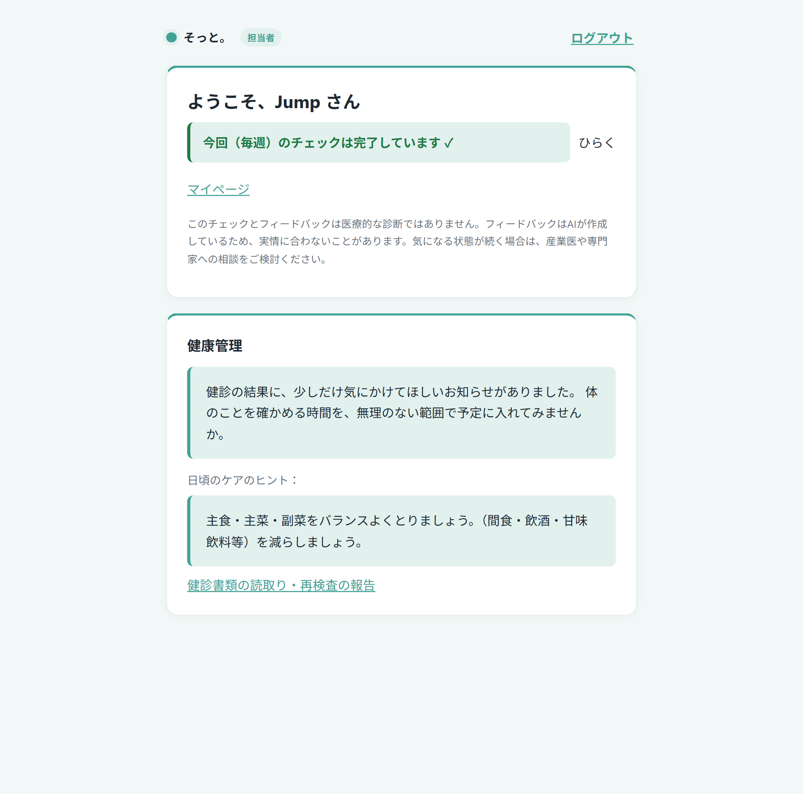
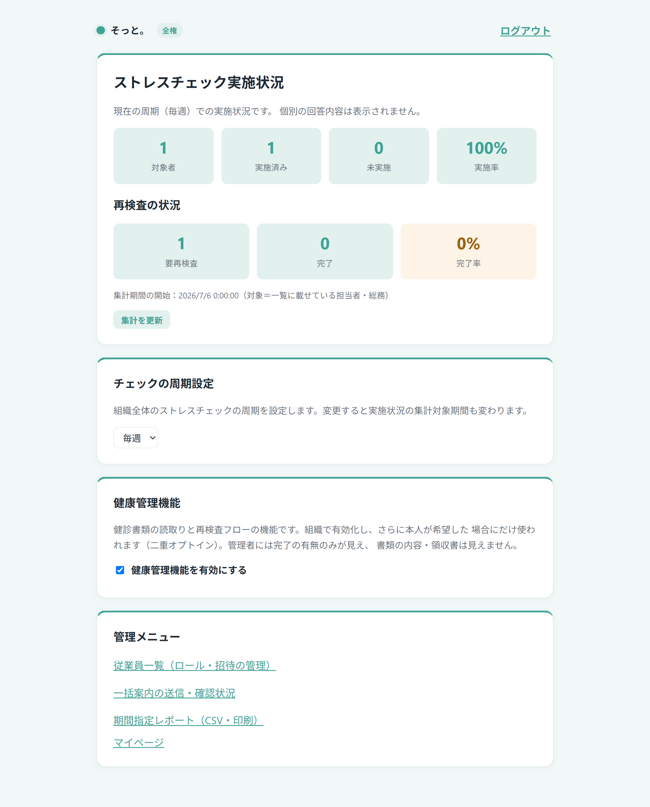
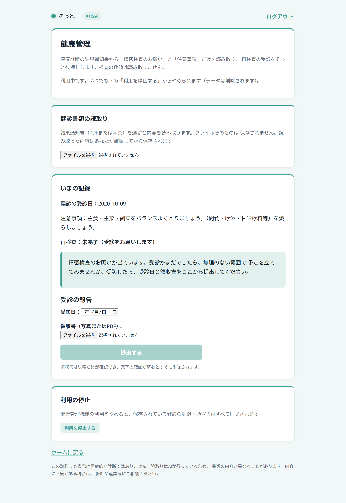
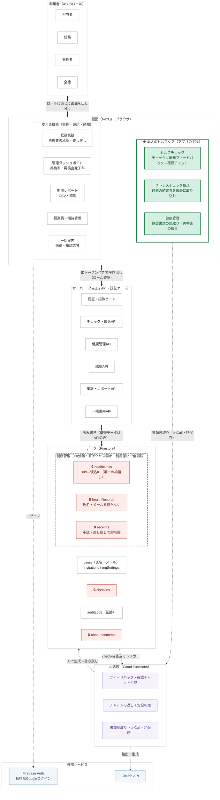

# そっと。 — 続けられるセルフケアのためのストレスチェック・健康管理アプリ

形骸化しがちな「年1回のストレスチェック」を、**続けられる日常のセルフケア**に変えることを目指したアプリです。
AIが過去との比較（縦断フィードバック）で一人ひとりに気づきを届け、確からしくないときは断定せず、そっと問い返します。
心のチェックと体の健康管理を、**本人が主体的に扱える**ように設計しました。

## スクリーンショット

| 担当者のホーム | 権限者ダッシュボード | 健康管理（本人） |
|:--:|:--:|:--:|
|  |  |  |
| やさしい言葉づかいと「気づきの窓」 | 実施状況・再検査・レポートの一覧 | 読取り→本人確認、停止で全削除 |

> [!TIP]
> **実際に触ってみるのが、いちばん伝わります。** 招待制のデモをぜひお試しください（下記「デモ」参照）。

## 技術構成

- **フロントエンド**: Next.js (App Router) + React + TypeScript
- **バックエンド**: Firebase（Firestore / Cloud Functions / Authentication）
- **認証**: Firebase Auth + Google プロバイダ（招待制）
- **AI**: Claude API（Cloud Functions 側のみで使用。APIキーはクライアントに出ない）
- **デプロイ**: Vercel（フロント）+ Firebase（Rules / Functions）

## デモ

招待制のデモを公開しています（ログインには招待が必要です）。
お試しをご希望の方は、本ページ下部の「作者・お問い合わせ」までお気軽にご連絡ください。

> [!NOTE]
> 招待の承認には **Google アカウント（Gmail）** が必要です。
> お試し後に「使用済み」とひとことご連絡いただければ、こちらで責任をもってアカウントを削除いたします。

🔗 https://sotto-self-care.vercel.app

## 設計ドキュメント（システムの正体）

### ロール × 機能の対応

| 機能 | 担当者 | 総務 | 管理者 | 全権 |
|---|:--:|:--:|:--:|:--:|
| セルフチェック・確認チャット | ● | ● | | |
| ストレスチェック取込（マイページ） | ● | ● | | |
| 健康管理（読取り・再検査の報告） | ● | ● | | |
| 総務業務（再検査の承認・差し戻し） | | ● | | |
| 管理ダッシュボード・期間レポート | | | ● | ● |
| 従業員・招待管理（一覧・ロール付与） | | | ●（閲覧・一覧） | ●（付与/剥奪） |
| 一括案内 | 受信・確認応答 | 送信＋受信 | 送信＋受信 | 送信＋受信 |

管理者・全権に見えるのは実施率や完了の有無といった**集計値だけ**で、個別の回答内容・診断数値・健診の中身・領収書は
Security Rules レベルで見えません。「誰が管理する権限を持つか」と「誰の何が見えるか」を、コードだけでなく Rules で二重に強制しています。

### なぜ「3問」なのか

「たった3問で何がわかるのか」と思われるかもしれません。でも、この3問は偶然ではありません。

国が定めるストレスチェック（57項目）は、**①仕事のストレス要因 ②心身のストレス反応 ③周囲のサポート**の3領域で心の状態をとらえます。
「そっと。」の毎回のチェックは、この**3領域から1問ずつ**に絞った3問です。

設問を最小にしたのは、**続けられること**を最優先にしたから。そもそも57項目に毎回向き合うのは、それ自体が負担です——
**ストレスを測るはずのチェックが、ストレスの原因になっては本末転倒**。年1回にとどまり形骸化しがちな57項目に対して、
3問・約30秒なら無理なく続けられます。そして本当の気づきは、1回の詳細な結果ではなく、
**続けた記録どうしの比較（前回との変化）**から生まれます。3軸に絞っているからこそ変化がはっきり見え、
「急変したときだけそっと問い返す」という仕組みも成り立ちます。

**たった3問、されど3問**——手抜きではなく、「続けて、変化に気づく」という設計思想の要です。

### 機能の中身（表や図で説明しきれない部分）

小さなアプリに見えて、実運用で「迷わない・急かさない」ための UI と仕掛けを各所に作り込んでいます。

- **心のセルフケア** — 3問・約30秒のチェック。過去との比較（縦断RAG）で「前回に比べて…」と気づきを届けます。
  回答が急変したときだけ、煽らずに問いを1つ返す**確認チャット**（1往復半で静かに閉じ、会話は続けない）。
  重い内容には AI 生成を止めて**固定の安全メッセージ＋公的相談窓口**を案内し、深掘りも通報もしません。
- **資料で解像度を上げる** — 過去のストレスチェック結果票（紙・PDF）を AI で読み取り、際立つ特徴を「言葉で」保持。
  資料には直接触れずに語りの具体性へ活かします。資料を貼れない人にも、そっと気づきを届けられる設計です。
- **体の健康管理** — 健診書類を AI で読み取り、**本人が確認・訂正してから保存**（AI の誤読を本人確認で止める「確かめる思想」）。
  書類そのものはどこにも保存しません。
- **担当とのやりとり（総務フロー）** — 再検査は、本人が受診日＋領収書を提出 → 総務が承認、または理由を一言添えて**差し戻し** →
  本人が再提出、という往復。状態から導出する**お知らせバナー**は、対応が済むと自動で消えます（消し忘れがない）。
- **通知・報告** — 「対象者全員」または「セルフチェック未実施者のみ」に**一括案内**。受け取った人は「確認しました」を
  1タップで返すだけ（自由入力なし＝報告の仕組み化。双方の事務負荷を減らす）。
- **帳票・ダッシュボード** — 管理者は実施率・再検査完了率などの集計を閲覧。期間を指定して **CSV ダウンロード＋ブラウザ印刷**。
- **プライバシー設計** — 健康の機微データは氏名を持たない仮名 ID で分離管理し、本人が利用を停止すると即時に全削除。
  権限操作・通知・書類受領は監査ログに証跡を残します（本文などの機微は残しません）。
- **やさしい UI** — 完了後に畳むアコーディオン、ホームの「気づきの窓」、遷移前後を“同じ色でつなぐ”導線など、
  直感的に操作できるよう工夫しました。

### アーキテクチャ図

本人が主体的に行うセルフケア（緑の枠）を主役に、総務・管理者の運用機能がそれを支える構成です。
**機微データ（🔒）はクライアントから直接触れず、必ずサーバー API を経由**します。
図の読み方・セキュリティ設計の詳細・データモデルは **[docs/architecture.md](docs/architecture.md)** を参照してください。

## 👤 作者・お問い合わせ

**作者**: Toika（トイカ）

「問うて確かめる」を大切に、断定しすぎず、使う人の余白を残すものづくりを目指しています。

**お問い合わせ**:

アプリに関するご質問・ご意見・お仕事のご相談などがありましたら、お気軽にご連絡ください。

📧 `info@toika.jp` （左記アドレスをコピーしてご連絡ください）

## ライセンス・利用規約

本リポジトリは、作者の個人開発によるポートフォリオ作品です。ソースコードの著作権は作者に帰属します。
学習・参考のための閲覧は歓迎しますが、無断での商用利用・再配布・そのままのデプロイはご遠慮ください（ご相談は歓迎します）。

**免責**：本アプリのチェック・フィードバック・書類読取りは、医療的な診断ではありません。
フィードバックや読取りは AI が生成・抽出するため、実情や書類の内容と異なる場合があります。
気になる状態が続くときは、産業医や専門家へのご相談をご検討ください。
本アプリはデモ・ポートフォリオであり、実運用の医療・労務サービスではありません。
