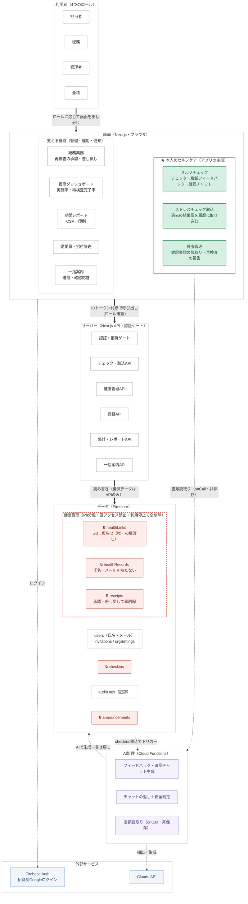

# そっと。

日々のセルフケアを支援するストレスチェック・健康管理アプリ（リメイク版）。

形骸化しがちな年1回のストレスチェックを「継続できる日常のセルフケア」に変えることを目指しています。
AIが過去との比較（縦断フィードバック)で一人ひとりに気づきを届け、確からしくないときは断定せずにそっと問い返します。

## 技術構成

- **フロントエンド**: Next.js (App Router) + React + TypeScript
- **バックエンド**: Firebase（Firestore / Cloud Functions / Authentication）
- **認証**: Firebase Auth + Google プロバイダ（招待制）
- **AI**: Claude API（Cloud Functions 側のみで使用。APIキーはクライアントに出ない）
- **デプロイ**: Vercel（フロント）+ Firebase（Rules / Functions）

## 特徴的な設計

- **招待ゲート**: 招待されたメールアドレスの Google アカウントだけが参加できる。
  ユーザー作成はサーバー側APIのみが行い、Security Rules でも二重に強制。
- **4段階ロール + 最小権限**: member / hr / admin / owner。管理者は実施状況の集計のみ閲覧でき、
  個別の回答内容は Security Rules レベルで見えない。
- **監査ログ**: ロール変更・招待発行などの権限操作はすべて `auditLogs` に記録。
  ガードレール（管理者ゼロ禁止・自己昇格禁止・確認ダイアログ）付き。
- **データの器と判断の物差しの分離**: ユーザーデータは Firestore、AIの判断基準は
  1つの Markdown ファイル（`functions/knowledge/care-policy.md`・リポジトリ追跡対象外）。
  ナレッジを推敲するだけでコードを触らずにフィードバックの方向性を変えられる。
- **縦断RAG**: 直近N回の回答推移を Claude に渡し、過去との比較で気づきを促す。
- **確認チャット**: 回答の急変を検知したときだけ、非刺激的な確認質問を1つ生成する。
- **健康管理の PII 分離**: 氏名・メールは `users` に、健康の機微データは氏名・uid を持たない
  仮名ID（`healthId`）で管理し、両者をつなぐマッピングもサーバー経由でのみ辿れる。
  機微データはクライアントから直接読めず（Rules で全面 deny）、本人が利用を停止すると
  ため込んだ健康データを即時に全削除する（データ最小化）。

## アーキテクチャ

「そっと。」は、本人が主体的に行うセルフケア（心のストレスチェックと体の健康管理）を主役に据え、
総務・管理者の運用機能がそれを支える構成です。機微なデータほど厳重に扱うプライバシー優先の設計で、
機微データはすべてサーバーAPI経由でのみ read/write します。

図の読み方・セキュリティ設計の詳細・ロール×機能の対応表は
**[docs/architecture.md](docs/architecture.md)** を参照してください。

## セットアップ

1. `.env.local.example` をコピーして `.env.local` を作成し、Firebase の値を設定
2. `functions/knowledge/care-policy.example.md` をコピーして `care-policy.md` を作成
3. 依存をインストール: `npm install` と `cd functions && npm install`
4. 最初の全権ユーザーを用意: `cd functions && npm run set-owner -- you@example.com`
5. 開発サーバー: `npm run dev`

Cloud Functions のデプロイには `ANTHROPIC_API_KEY` のシークレット登録が必要です:
`firebase functions:secrets:set ANTHROPIC_API_KEY`

## 免責

このアプリのチェックとフィードバックは医療的な診断ではありません。
