# アーキテクチャ

「そっと。」は、**本人が主体的に行うセルフケア**（心のストレスチェックと体の健康管理）を主役に据え、
総務・管理者の運用機能がそれを支える構成です。機微なデータほど厳重に扱う、というプライバシー優先の設計になっています。

## 全体像

```mermaid
flowchart TB
  %% ===================== 利用者 =====================
  subgraph Roles["利用者（4つのロール）"]
    direction LR
    member["担当者"]
    hr["総務"]
    admin["管理者"]
    owner["全権"]
  end

  %% ===================== 画面 =====================
  subgraph Client["画面（Next.js・ブラウザ）"]
    direction TB
    subgraph Core["★ 本人のセルフケア（アプリの主役）"]
      direction LR
      scSelf["セルフチェック<br/>チェック→縦断フィードバック→確認チャット"]
      scMy["ストレスチェック取込<br/>過去の結果票を履歴に取り込む"]
      scHealth["健康管理<br/>健診書類の読取り・再検査の報告"]
    end
    subgraph Support["支える機能（管理・運用・通知）"]
      direction LR
      scHr["総務業務<br/>再検査の承認・差し戻し"]
      scAdmin["管理ダッシュボード<br/>実施率・再検査完了率"]
      scReport["期間レポート<br/>CSV・印刷"]
      scUsers["従業員・招待管理"]
      scAnn["一括案内<br/>送信・確認応答"]
    end
  end

  %% ===================== サーバー =====================
  subgraph Server["サーバー（Next.js API・認証ゲート）"]
    direction LR
    apiGate["認証・招待ゲート"]
    apiCheck["チェック・取込API"]
    apiHealth["健康管理API"]
    apiHr["総務API"]
    apiAdmin["集計・レポートAPI"]
    apiAnn["一括案内API"]
  end

  %% ===================== AI処理 =====================
  subgraph Funcs["AI処理（Cloud Functions）"]
    direction LR
    fnFb["フィードバック・確認チャット生成"]
    fnReply["チャットの返し＋安全判定"]
    fnParse["書類読取り（onCall・非保存）"]
  end

  %% ===================== データ =====================
  subgraph Data["データ（Firestore）"]
    direction LR
    dbGen["users（氏名・メール）<br/>invitations / orgSettings"]
    dbCheck["🔒 checkins"]
    dbAudit["auditLogs（証跡）"]
    dbAnn["🔒 announcements"]
    subgraph PII["健康管理（PII分離・直アクセス禁止・利用停止で全削除）"]
      direction LR
      dbLink["🔒 healthLinks<br/>uid→仮名ID（唯一の橋渡し）"]
      dbRec["🔒 healthRecords<br/>氏名・メールを持たない"]
      dbRcpt["🔒 receipts<br/>承認・差し戻しで即削除"]
    end
  end

  %% ===================== 外部 =====================
  subgraph Ext["外部サービス"]
    direction LR
    auth["Firebase Auth<br/>招待制Googleログイン"]
    claude["Claude API"]
  end

  %% ---------- 主要な流れ（太線・層どうし） ----------
  Roles ==>|ロールに応じて画面を出し分け| Client
  Client ==>|IDトークン付きで呼び出し（ロール確認）| Server
  Server ==>|読み書き（機微データはAPIのみ）| Data

  %% ---------- 補助的な流れ（点線） ----------
  Client -. ログイン .-> auth
  Core -. 書類読取り（onCall・非保存） .-> Funcs
  Data -. checkins書込でトリガー .-> Funcs
  Funcs -. AIで生成→書き戻し .-> Data
  Funcs -. 抽出・生成 .-> claude

  %% ---------- 色（主役＝緑／機微＝赤＋🔒／AI・外部は淡色／他は白） ----------
  classDef default fill:#ffffff,stroke:#9aa0a6,color:#202124;
  classDef core fill:#d5efe3,stroke:#1f7a44,stroke-width:2px,color:#14532d;
  classDef sensitive fill:#fdecea,stroke:#c0392b,color:#7b241c;
  classDef ai fill:#f5f2fc,stroke:#8a7bbf,color:#4a3f7a;
  classDef ext fill:#f2f6fb,stroke:#7fa3cc,color:#2c4a6b;
  class scSelf,scMy,scHealth core;
  class fnFb,fnReply,fnParse ai;
  class dbCheck,dbLink,dbRec,dbRcpt,dbAnn sensitive;
  class auth,claude ext;

  %% ---------- 大枠は白背景（区別は枠線と中の箱で） ----------
  style Roles fill:#ffffff,stroke:#cccccc
  style Client fill:#ffffff,stroke:#cccccc
  style Core fill:#ffffff,stroke:#1f7a44,stroke-width:2px
  style Support fill:#ffffff,stroke:#dddddd
  style Server fill:#ffffff,stroke:#cccccc
  style Funcs fill:#ffffff,stroke:#cccccc
  style Data fill:#ffffff,stroke:#cccccc
  style PII fill:#ffffff,stroke:#c0392b,stroke-width:2px,stroke-dasharray:5 3
  style Ext fill:#ffffff,stroke:#cccccc
```

## 凡例

| 見た目 | 意味 |
|---|---|
| 🟩 緑の箱（★グループ） | 本人が主体的に行うセルフケア＝アプリの主役 |
| 🟥 赤い箱＋🔒 | 機微データ。クライアントから直接触れず、サーバーAPI経由でのみ扱う |
| 赤い破線の枠 | PII分離の境界（健康管理）。この中には氏名・メール・uid を持たせない |
| 🟪 淡い紫 | AI処理（Cloud Functions） |
| 🟦 淡い青 | 外部サービス |
| 白い箱 | それ以外（ロール・支える機能・API・一般データ） |
| 太い矢印 | 主要な流れ（画面 → サーバー → データ） |
| 点線の矢印 | 補助的な流れ（ログイン・AI連携・トリガー） |

## 設計の要点（図だけでは読み取りにくい部分の補足）

### 1. クライアントは機微データを直接読めない
`checkins`・`announcements`・健康管理の3コレクション（`healthLinks`/`healthRecords`/`receipts`）は、
Firestore Security Rules で**クライアントからの直接アクセスを全面的に禁止**しています。
読み書きはすべてサーバー（Next.js API Route / Cloud Functions）を通り、そこで
IDトークンの検証とロール確認を行います。図の太い矢印が必ずサーバーを経由するのはこのためです。
（非機微な自分のデータ＝自分の `checkins` の閲覧や `orgSettings` などは、本人に限り
`onSnapshot` で直接購読します。）

### 2. PII分離 ― 「誰の」と「どんな健康状態か」を同じ場所に置かない
- **氏名・メール**は通常の `users`（および認証本体の Firebase Auth）に保管します。
- **健康の機微データ**（再検査の要否・注意事項・領収書）は、氏名・メール・uid を一切持たない
  仮名ID（`healthId`）だけで管理します。
- 両者をつなぐのは `healthLinks`（uid → 仮名ID のマッピング）**だけ**で、これもクライアントから
  直接は辿れずサーバーAPI経由のみです。

この結果、**`healthRecords` 単体が漏れても「誰のものか」が分からない**構造になっています。

### 3. 利用停止で、ため込んだ健康データを即時に全削除
本人が健康管理の利用を停止（オプトアウト）すると、`healthRecords` と `receipts` を
**即座にすべて削除**し、`auditLogs` に記録を残します（データ最小化＝「使わないならデータは残さない」）。
`healthLinks`（仮名ID・読取り回数）だけは、再開時に同じ仮名IDを引き継ぐために残しますが、
医療情報は持ちません。なお健診書類そのものは元々**保存していません**（読取り時に使い切り）。

### 4. 監査ログ
ロール変更・招待発行・書類受領・完了承認・差し戻し・一括案内の送信は、すべて `auditLogs` に
証跡を残します。ただし**本文・注意事項・領収書などの機微な内容はログに入れません**
（`auditLogs` は管理者も閲覧できるため）。

### 5. AIの扱い
- Claude API はすべて**サーバー側（Cloud Functions）でのみ**呼び出し、APIキーはクライアントに出しません。
- 健診・ストレスチェック書類の読取りは `onCall` で行い、抽出結果を返すだけで**書類は保存しません**。
- 縦断フィードバック・確認チャット・チャットの返しは、`checkins` への書き込みを
  **Firestore トリガー**で受けて生成し、結果を書き戻します。

## ロール × 機能の対応

| 機能 | 担当者 | 総務 | 管理者 | 全権 |
|---|:--:|:--:|:--:|:--:|
| セルフチェック・確認チャット | ● | ● | | |
| ストレスチェック取込（マイページ） | ● | ● | | |
| 健康管理（読取り・再検査の報告） | ● | ● | | |
| 総務業務（再検査の承認・差し戻し） | | ● | | |
| 管理ダッシュボード・期間レポート | | | ● | ● |
| 従業員・招待管理（一覧・ロール付与） | | | ●（閲覧・一覧） | ●（ロール付与/剥奪） |
| 一括案内 | 受信・確認応答 | 送信＋受信 | 送信＋受信 | 送信＋受信 |

管理者・全権は実施状況や完了の有無といった**集計値のみ**を閲覧でき、個別の回答内容・診断数値・
健診の中身・領収書は Security Rules レベルで見えません。
